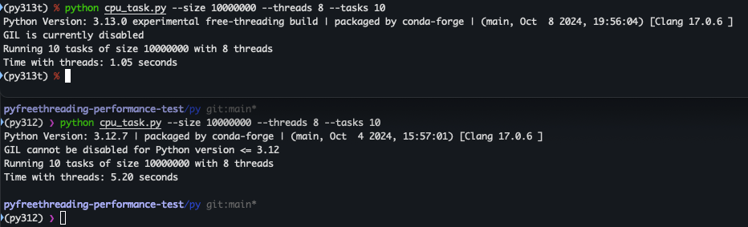
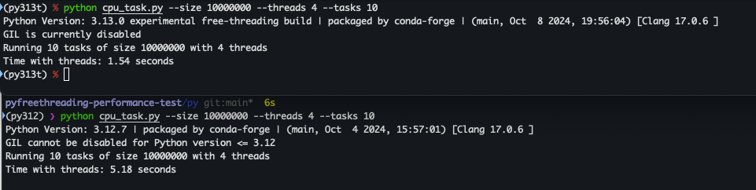
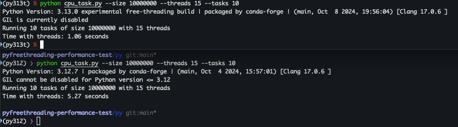

alias ft=free-threading

直接上结论，就本仓库这个测试脚本来说，测试下来最大提升貌似就5x左右了。

一开始使用4个线程去跑，提升只有3x左右。

尝试增加线程数，使用15个线程数，提升也是5x左右。

所以这个实验性的ft测试下来最大提升5x左右,但是测试过程中发现ft每次执行的时候CPU使用率都很高。

---

## todo

- [ ] CPU使用率和内存使用的测试
- [ ] 对比go和rust
